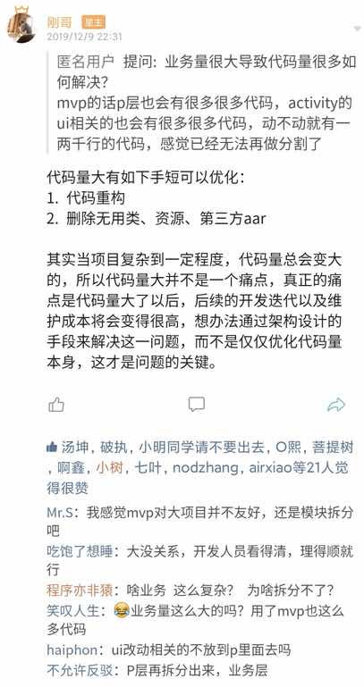
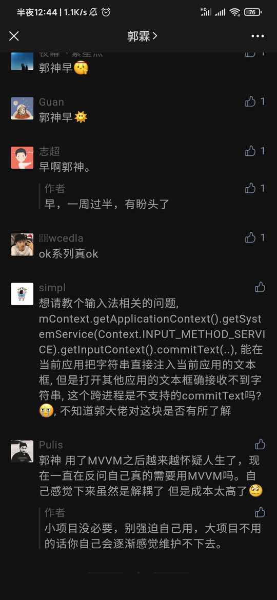
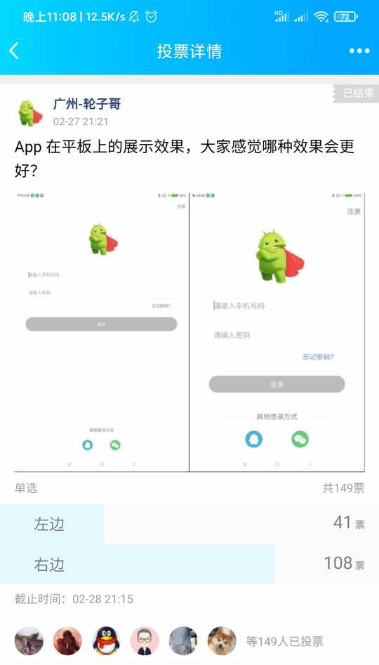
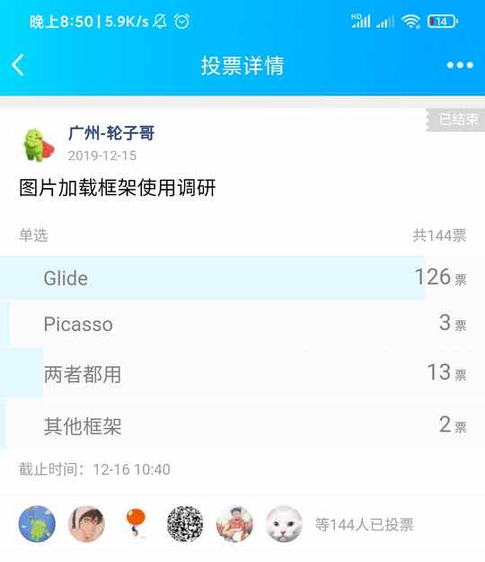
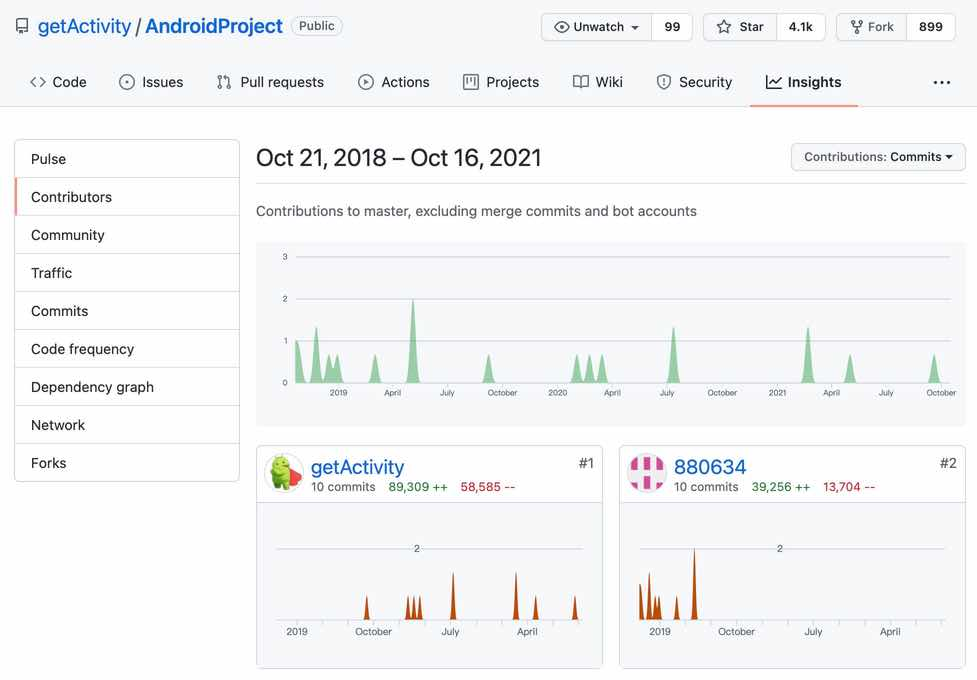

#### 目录

* [为什么没有用 MVP](#为什么没有用-mvp)

* [为什么没有用 ButterKnife](#为什么没有用-butterknife)

* [为什么没有用 ViewBinding](#为什么没有用-viewbinding)

* [为什么没有用 DataBinding](#为什么没有用-databinding)

* [为什么没有用组件化](#为什么没有用组件化)

* [为什么没有集成界面侧滑功能](#为什么没有集成界面侧滑功能)

* [为什么没有用今日头条的适配方案](#为什么没有用今日头条的适配方案)

* [字体大小为什么不用 dp 而用 sp](#字体大小为什么不用-dp-而用-sp)

* [为什么没有用 DialogFragment 来防止内存泄漏](#为什么没有用-dialogfragment-来防止内存泄漏)

* [为什么没有用腾讯 X5 WebView](#为什么没有用腾讯-x5-webview)

* [为什么没有用单 Activity 多 Fragment](#为什么没有用单-activity-多-fragment)

* [为什么没有用 ConstraintLayout 来写布局](#为什么没有用-constraintlayout-来写布局)

* [为什么不拆成多个框架来做这件事](#为什么不拆成多个框架来做这件事)

* [为什么最低兼容到 Android 5.0](#为什么最低兼容到-android-50)

* [为什么不加入 XXX 功能](#为什么不加入-xxx-功能)

* [为什么不加入 EventBus](#为什么不加入-eventbus)

* [为什么没有用 Retrofit 和 RxJava](#为什么没有用-retrofit-和-rxjava)

* [为什么没有用 Jetpack 全家桶](#为什么没有用-jetpack-全家桶)

* [为什么不对图片加载框架进行再次封装](#为什么不对图片加载框架进行再次封装)

* [模板 架构 技术中台有什么区别](#模板-架构-技术中台有什么区别)

* [为什么不按业务来划分包名](#为什么不按业务来划分包名)

* [为什么没有关于列表多 type 的封装](#为什么没有关于列表多-type-的封装)

* [这不就是一个模板工程换成我也能写一个](#这不就是一个模板工程换成我也能写一个)

* [假设 AndroidProject 更新了该怎么升级它](#假设-androidproject-更新了该怎么升级它)

* [为什么不用谷歌 ActivityResultContracts](#为什么不用谷歌-activityresultcontracts)

* [为什么新版移除了权限申请的 AOP 注解](#为什么新版移除了权限申请的-aop-注解)

* [轮子哥你怎么看待层出不穷的新技术](#轮子哥你怎么看待层出不穷的新技术)

#### 为什么没有用 MVP






* AndroidProject 舍弃 MVP 的最大一个原因，需要写各种类，各种回调，如果这个页面比较简单的话，使用 MVP 会让原本简单的代码变复杂，导致后续开发和维护成本是非常高，前期付出的代价和后期的维护不成正比关系，当然这种说法只适用于各种中小型项目，大型的项目我还没有经历过，不过我觉得，无论是 MVC、MVP、MVVM，它们出现的目的是为了解决代码多并且乱的问题，作用就是给代码做分类，但是可以跟大家分享我的心得，我并不看好 MVP，因为它让我开发和维护都很痛苦，所以我就直接将它从 AndroidProject 移除，目的也很简单，不推荐大家使用，因为 MVP 不适合大多数项目的开发和维护。我更推荐大家直接将代码写在 Activity，但是有一个前提条件需要大家遵守，大家要做好代码封装和重复代码的抽取，尽量让 Activity 成为只有业务代码的类，这样一个项目里面的大多数 Activity 代码量都能很好控制在 1000 行代码以内。但是这种看似简单的操作，但是实际要做到是一件不容易的事情，这里面不仅要解决代码带来的问题，还要解决带来的各种人性矛盾，困难重重，这种想法经过很长一段时间的思考，虽然写法在开发和维护中效率是非常高的，但是不被大多数人认可，大家更愿意相信 MVC、MVP、MVVM，而很少有人理解这三种模式的本质是什么，就是为了给代码做分类，但这三种模式都不够灵活，很生硬，像是一套套规则，而这样的代码分类，只会让大多数人的开发越来越头疼。

#### 为什么没有用 ButterKnife

* 随着 AndroidProject 的不断优化，ButterKnife 功能很强大，但是实际开发中，大多数人只用到了 BindView 和 OnClick 注解，在 OnClick 注解在我的项目中发现一个 Bug，就是有时候不会响应点击事件，这个问题并不是必现的。还有 BindView 注解只是在视觉上面将 View 和 ID 的关系更明显了，它其实不能为我们简化代码，因为使用 BindView 和 findViewById 的代码量是一样的。

* ButterKnife 最大的缺点是还会自动生成 ViewBinding 类，就算在类中只使用了一个 BindView，它也会生成这个类，其实这样是不太好的。

* 另外一个点，将 Android Studio 升级到 4.1 之后，会出现以下提示，这个是因为 Gradle 在 5.0 之后的版本，View ID 将不会以常量的形式存在，所以不能将其定义在 `BindView` 注解或者在 `switch case` 块中。

```text
Resource IDs will be non-final in Android Gradle Plugin version 5.0, avoid using them as annotation
Resource IDs will be non-final in Android Gradle Plugin version 5.0, avoid using them in switch case statements
```

* 考虑到这些情况，我在新版的 AndroidProject 上面移除了 ButterKnife 框架，其实 findViewById 一直挺好，只是我们没有认真思考过而已。

* 另外大家如果不想写 findViewById，我可以推荐一款自动生成 findViewById 的插件给大家：[FindViewByMe](https://plugins.jetbrains.com/plugin/8261-findviewbyme)

#### 为什么没有用 ViewBinding

* 首先 ViewBinding 和 ButterKnife 有一个相同的毛病，就是自动生成一个类，然后在这个类里面进行 findViewById，但是有一个致命的缺点，每个 `Activity / Fragment / Dialog / Adapter` 都需要先初始化 ViewBinding 对象，因为每次生成的类名都是不固定的，所以无法在基类中封装处理，并且每次都要写 `binding.xxx` 才能操作控件。

```java
ActivityXxxxBinding.inflate binding = ActivityXxxxBinding.inflate(getLayoutInflater());
binding.tv_data_name.setText("字符串");
```

* 另外一个它会根据控件 id 作为属性的名称，这样会导致一个代码不规范的问题，如果在 xml 中控件的 id 命名符合规范了，会导致在 Java 代码中的命名不规范，如果在 Java 代码中的命名规范了，又会导致 xml 的 id 不符合规范了。而代码规范关系到后续的代码维护，是一个很重要的问题，不容忽视。

* 虽然 ViewBinding 是谷歌官方推荐的，但是我觉得并不完美，解决了 findViewById 的同时又带来了其他的问题，在关键问题上有问题和矛盾，直白点说这些问题都是硬伤。

* 正如我上面所说的，findViewById 一直挺好，只是我们没有认真思考过而已。

* 另外大家如果不想写 findViewById，我可以推荐一款自动生成 findViewById 的插件给大家：[FindViewByMe](https://plugins.jetbrains.com/plugin/8261-findviewbyme)

#### 为什么没有用 DataBinding

* DataBinding 最大的优势在于，因为它可以在 xml 直接给 View 赋值，但它的优点正是它最致命的缺点，当业务逻辑简单时，会显得格外美好，但是一旦判断条件复杂起来，由于 xml 属性不能换行的特性，会导致无法在 xml 直接赋值又或者很长的一段代码堆在布局中，间接导致 CodeReview 时异常艰难，更别说在原有的基础上继续更新迭代，这对每一个开发者来讲无疑是一个巨大的灾难。

* 还有一个是 DataBinding 的学习成本比较高，其次使用成本也挺高，使用前需要做很多封装，另外每次使用时都需要添加 `layout` 和 `data` 节点，然后在 Java 代码中初始化 DataBinding 对象，无法在基类中封装处理，每次都要写 `binding.xxx` 才能操作控件，和 ViewBinding 的问题差不多。

```java
ActivityXxxxBinding binding = DataBindingUtil.setContentView(this, R.layout.activity_xxxx);
```

#### 为什么没有用组件化

* 先来说说组件化的优点，能够把不同的业务代码进行隔离，达到完全解耦的效果，同时也能提升编译和打包速度。但是这两个优点只有项目业务变得大并且复杂的情况下才能产生价值，否则价值并不大，在我看来，代码解耦其实是把双刃剑，解耦的过程相对比较麻烦，这会直接加大前期开发的工作量，并且一些解耦的方式可能会导致代码重复，例如 AndroidManifest 清单文件，需要同时配置两份文件，后期改动也需要改两遍，另外一个是路由跳转，现在大多数路由框架都是通过 APT 生成一张映射表，这个需要我们每写一个 Activity 都要写一个路径的注解，这个不仅写起来麻烦，管理起来也会很麻烦，另外对每个业务模块的 SDK 初始化操作和数据存储交互上又该如何处理和解耦？这些都是组件化所存在的问题，矛和盾又该如何抉择？

* 组件化其实是一个很好的思想，但是它并不适用于中小型项目，因为这些项目并没有那么复杂，大部分业务模块都很小，大的业务模块其实也不多，当然我个人建议可以将大点的模业务进行模块化，但是没有必要做组件化，因为一旦涉及，从组件化中得到弊会大于利。而在一些大型的项目中，大大小小的模块非常多，一次打包编译可能要半个小时甚至更久（请注意大厂的电脑基本都是高配或者顶配），相比较这种情况之下，组件化的优点就已经大于了它的缺点，同时他们也有充足的人力和过硬的技术，并且能长期投入巨大的时间和精力来做这件事。

* AndroidProject 面对的是大众开发者，所以更倾向中小型的项目代码的设计，虽然我没有做过大型的项目，但是在我看来是差不多的，最大的不同可能是代码分类方式的不同，该做的事情不会少，该写的代码也不会少，就是业务和代码的体量上比我们大，所以他们要处理体量大所带来的的问题。

#### 为什么没有集成界面侧滑功能

* AndroidProject 其实有加入过这个功能，但是在 [v9.0 版本](https://github.com/getActivity/AndroidProject/releases/tag/9.0) 就移除了，原因是第三方侧滑框架 [BGASwipeBackLayout](https://github.com/bingoogolapple/BGASwipeBackLayout-Android) 在 Android 9.0 上面会[闪屏](https://github.com/bingoogolapple/BGASwipeBackLayout-Android/issues/173)，并且还是 **100% 必现**，**用户体验极差**，我也跟作者反馈过这个问题，但结果不了了之，所以不得不移除。但是到了 [v10.0 版本](https://github.com/getActivity/AndroidProject/releases/tag/10.0)，我又加上界面侧滑功能了，不过这次我换成了 [SmartSwipe](https://github.com/luckybilly/SmartSwipe) 来做，但是我又再一次失望了，这个框架在 Android 11 上面，如果 Activity 上有 WindowManager 正在显示，然后使用界面侧滑，那么会出现闪屏的情况，具体效果如下图：


* 就这个情况我也联系过作者，并详细阐述了产生的原因和具体的复现步骤，但是我等了三天连个回复都没有，实属有些让我心寒，在等待的期间我看到 Github 的 issue 已经基本没有回复了，并且最后一次提交是在 13 个月前了，种种迹象都已经表明，所以经过慎重考虑，最终决定在 [v12.1 版本](https://github.com/getActivity/AndroidProject/releases/tag/12.1) 移除界面侧滑功能。

#### 为什么没有用今日头条的适配方案

* 关于屏幕适配方案，其实不能说头条的方案就是最好的，其实谷歌已经针对屏幕适配做了处理，就是 dp 和 sp ，而 dp 的计算转换是由屏幕的像素决定，系统只认 px 单位， dp 需要进行转换，比如 1dp 等于几个 px ，这个时候就需要基数进行转换，比如 1dp = 2px，这个基数就是 2。

```text
ldpi：1dp=0.75px

mdpi：1dp=1px

hdpi：1dp=1.5px
 
xhdpi：1dp=2px

xxhdpi：1dp=3px

xxxhdpi：1dp=4px
```
	
* 这个是谷歌对屏幕适配的一种默认方式，厂商也可以根据需要去修改默认的基数，从而达到最优的显示效果。

* 谷歌的屏幕适配方案也不是百分之一百完美的，其实会存在一些需求不能满足的问题。谷歌的设计理念是屏幕越大显示的东西越多，这种想法并没有错，但有些 App 可能对这块会有要求，希望根据屏幕大小对控件进行百分比压缩。这个时候谷歌那套适配方案的设计已经和需求完全不一致了。

* 那什么样的 App 才会有那样的需求呢？现在手机的屏幕大多在 5 - 6寸，而平板大多在 8 - 10 寸，也就是说我们只适配手机的话，只需要针对 5 - 6 寸的，并且它们的分辨率都差不多，其实用谷歌那种方案是最优的，如果我们需要适配平板的话，一般都会要求对控件进行百分比压缩，这个时候谷歌那套方案会把原先在手机显示的控件在平板上面变大一点，这样就会导致屏幕剩余的空间过大，导致控件显示出来的效果比较小，而如果采用百分比对控件压缩的方式，能比较好地控制 App 在不同屏幕下显示的效果。

* 另外谈谈我的经历，我自己之前的公司主要是做平板上面的应用，所以也用过 [AutoSize 框架](https://github.com/JessYanCoding/AndroidAutoSize)，一年多的使用体验下来，发现这个框架 Bug 还算是比较多的，例如框架会偶尔出现机型适配失效，重写了 **getResources** 方法情况之后出现的情况少了一些，但是仍然还有一些奇奇怪怪的问题，这里就不一一举例了，最后总结下来就是框架还不够成熟，但是框架的思想还是很不错的。我后面换了一家公司，也是做平板应用，项目用的是用[通配符的适配方案](https://github.com/wildma/ScreenAdaptation)，跟 AutoSize 相对比，没有了那些奇奇怪怪的问题，但是代码的侵入性比较高。这两种方案各有优缺点，大家看着选择。



* 在这块我也发起过群投票，相比谷歌的适配方案，大多数人更认同那种百分比适配方案，秉承着少数服从多数的理念，我在 AndroidProject [v13.0 版本](https://github.com/getActivity/AndroidProject/releases/tag/13.0) 加入了通配符的适配方案。虽然有一部分人不认同，但是我想跟这些人说的是：我的每一个决定都是十分谨慎的，因为这其中涉及到许多人的利益，AndroidProject 虽然是我创造的，但是它早就不是我一个人的了，而是大家的，每个重要的决定我都会考虑再三才会去做，在做决定的时候我会把大众的利益放在第一位，把自己的利益放在最后一位，所以大家唯一能做的是，相信我的选择。或许你可能觉得这样不太对，也随时欢迎你提出不同的意见给到我，我不认为自己做的决定一定都是对的，但是我会一直朝着对的方向前进。

#### 字体大小为什么不用 dp 而用 sp

* 首先我们先回顾一下谷歌原生的写法，将控件大小的单位定成了 dp，而字体大小的单位定成了 sp，而无论是 dp 还是 sp 作为单位，最终还是会转成 px 的单位。

* 谷歌这样做也有一定目的，dp 是根据屏幕的密度来计算的，而 sp 是根据手机设置的字体大小来计算的，如果用 dp 来代替 sp 会有一个问题，那么就是无论用户在手机里面怎么设置字体大小，应用的字体大小不会产生任何变化。这种场景对年轻人来讲没有太大的影响，而对一些老龄用户，例如我们的爸妈，他们一般会把手机的字体调大，这样才能看清楚里面的字，如果我们采用 dp 来代替 sp 的方案，会对这类用户造成不便，换位思考，我们终有一天也会变老，变得老眼昏花，我们会如何看待这个事情？

* 显然这种方式是不合理的，也非常地不人性化。网上这种方案可能主要就是为了解决把控件宽高写死之后，在某些字体上显示比较大的机型会出现字显示不全的问题，而这种把控件宽高写死的方式本身也是不合理的，应该在不得已的情况下才把控件的宽高写死，一般情况下我们应当使用自适应的方式，让控件自己测量自己的宽高，特别是在有显示字体的控件下，就更不应该把宽高写死。

#### 为什么没有用 DialogFragment 来防止内存泄漏

* DialogFragment 的出现就是为了解决 Dialog 和 Activity 生命周期不同步导致的内存泄漏问题，在 AndroidProject 曾经引入过，也经过了很多个版本的更新迭代，不过在 [10.0](https://github.com/getActivity/AndroidProject/releases/tag/10.0) 版本后就被移除了，原因是 Dialog 虽然有坑，但是 DialogFragment 也有坑，可以说解决了一个问题又引发了各种问题。先来细数我在 DialogFragment 上踩过的各种坑：

    1. DialogFragment 会占用 Dialog 的 Cancel 和 Dismiss 监听，为了就是在 Dialog 消失之后将自己（Fragment）从 Activity 上移除，这样的操作看起很合理，但是会引发一个问题，那么就是会导致我们原先给 Dialog 设置的 Cancel 和 Dismiss 监听被覆盖掉，间接导致我们无法使用这个监听，因为 Dialog 的监听器只能有一个观察者，而 AndroidProject 前期解决这个问题的方式是：将 Dialog 的监听器使用的观察者模式，从一对一改造成一对多，也就是一个被观察者可以有很多个观察者，由此来解决这个问题。
 
    2. DialogFragment 的显示和隐藏操作都不能在后台中进行，否则会出现一个报错 `java.lang.IllegalStateException: Can not perform this action after onSaveInstanceState`，这个是因为 DialogFragment 的 show 和 dismiss 方法使用了 FragmentTransaction.commit 方法，这个 commit 方法会触发对 Activity 状态的检查，如果 Activity 的状态已经保存了（即已经调用了 onSaveInstanceState 方法），这个时候把 Fragment commit 到 Activity 上会抛出异常，这种场景在执行异步操作（例如请求网络）未结束前，用户手动将 App 返回到桌面，然后异步操作执行完毕，下一步就是回调异步监听器，这个时候我们的 App 已经处于后台状态，那么我们如果在监听回调中 show 或 dismiss DialogFragment，那么就会触发这个异常。AndroidProject 前期对于这个问题的解决方案是重写 DialogFragment.show 方法，加一个对 Activity 的状态判断，如果 Activity 处于后台状态，那么不去调用 super.show()，但是这样会导致一个问题，虽然解决了崩溃的问题，但是又会导致 Dialog 没显示出来，而重写 DialogFragment.dismiss 方法，直接调用 dismissAllowingStateLoss 方法，因为这个方法不会去检查 Activity 的状态。虽然这种解决方式不够完美，但却是我那个时候能想到的最好方法。

    3. 最后一个问题是关于 DialogFragment 屏幕旋转的问题，首先 DialogFragment 是通过自身 onCreateDialog 方法来获取 Dialog 对象的，但是如果我们直接通过外层给 DialogFragment 传入 Dialog 的对象时，这样的代码逻辑貌似没有问题，但是在用户进行屏幕旋转，而刚好我们的应用没有固定屏幕方向时，DialogFragment 对象会跟随 Activity 销毁重建，因为它本身就是一个 Fragment，但是会导致之前的外层传入 Dialog 对象被回收并置空，然后再调用到 onCreateDialog 方法时，返回的是一个空对象的 Dialog，那么就会直接 DialogFragment 内部引发空指针异常，而 AndroidProject 前期解决这个问题的方案是，重写 onActivityCreated，赶在 onCreateDialog 方法调用之前，先判断 DialogFragment 对象内部持有的 Dialog 是否为空，如果是一个空对象，那么就将自己 dismissAllowingStateLoss 掉。

* 看过这些问题，你是不是和我一样，感觉这 DialogFragment 不是一般的坑，不过最终我放弃了使用 DialogFragment，并不是因为 DialogFragment 又出现了新问题，而是我想到了更好的方案来代替 DialogFragment，方案就是 Application.registerActivityLifecycleCallbacks，想必大家现在已经猜到我想干啥，和 DialogFragment 的作用一样，通过监听 Activity 的方式来管控 Dialog 的生命周期，但唯一不同的是，它不会出现刚刚说过 DialogFragment 的那些问题，这种方式在 AndroidProject 上迭代了几个版本过后，这期间没有发现新的问题，也没有收到别人反馈过这块的问题，证明这种方式是可行的。

#### 为什么没有用腾讯 X5 WebView

* 首先我问大家一个问题，腾讯出品的 X5 WebView  就一定比原生 WebView 好吗？我觉得未必，我依稀记得 Android 9.0 还是 Android 10 刚出来的时候，我点了升级按钮，然后就发现微信和 QQ 的网页浏览卡得让我怀疑人生，不过后面突然某一天就变好了，从这件事可以得出两点结论：

    1. 第一个 SDK 有自我更新功能，意味着 WebView 掌控权握在腾讯公司手中

    2. 第二个是 SDK 需要腾讯来持续维护，意味着这个项目的生命周期会跟随腾讯公司的发展和决策

* 基于以上两点，我的个人建议是优先使用原生 WebView，如果不满足需求了，可以自行替换成 X5 WebView，当然不是说 X5 WebView 一定不好，用原生 WebView 一定就好，而是 AndroidProject 的目标是稳中求胜，另外一个是 AndroidProject 中有针对 WebView 做统一封装，后续替换成 X5 WebView 的成本还算是相对较低的。

#### 为什么没有用单 Activity 多 Fragment

* 这个问题在前几年是一个比较火热的话题，我表示很能理解，因为新鲜的事物总是能勾起人的好奇，让人忍不住试一试，但是我先问大家一个问题，单 Activity 多 Fragment 和写多个 Activity 有什么优点？大家第一个反应应该是每写一个页面都不需要在清单文件中注册了，但是这个真的是优点吗？我可以很明确地告诉大家，我已经写了那么多句代码，不差那句在清单文件注册的代码。那么究竟什么才是对我们有价值的？我觉得就两点，一是减少前期开发的工作量，二是降低后续维护的难度。所以省那一两句有前途吗？我们是差那一两句代码的人吗？如果这种模式能够帮助我们写好代码，这个当然是有价值的，非常值得一试的，否则就是纯属瞎扯淡。不仅如此，我个人觉得这种模式有很大的弊端，会引发很多问题，例如：

    1. 有的页面是全屏有的页面是非全屏，有的页面是固定竖屏有的页面是横屏，进入时怎么切换？返回时怎么切换回来？然后又该怎么去做统一的封装？

    2. 不同 Fragment 之间应该怎样通讯？Activity 有 onActivityResult 方法可以用，但是 Fragment 有什么方法可以用？还是全用 EventBus 来处理？如果是这样做会不会太低效了？每次都要写一个 Event 类，并且在代码中找起来是不是也不太好找？

    3. 如何保证这个 Activity 被系统回收之后，然后引发重建操作，又该如何保证这个 Activity 中的多个 Fragment 之间的回退栈是否正常？假设这个 Activity 里面有 10 个Fragment，一下子引发 10 个 Fragment 创建是否会对内存和性能造成影响呢？

* 如果单 Activity 多 Fragment 不能为我们创造太大的价值时，这种模式根本就不值得我们去做，因为我们最终得到的，永远抵不上付出的。

#### 为什么没有用 ConstraintLayout 来写布局

* 大家如果有仔细观察的话，会发现 AndroidProject 其实没有用到 ConstraintLayout 布局，在这里谈谈我对这个布局的看法，约束布局有一个优点，没有布局嵌套，所以能减少测量次数，从而提升布局绘制的速度，但是优点也是它的缺点，正是因为没有布局嵌套，View 也就没有层级概念，所以它需要定义很多 ViewID 来约束相邻的 View 的位置，就算这个 View 我们在 Java 代码中没有用到，但是在约束布局中还是要定义。这样带来的弊端有几个：

    1. 我们每次都要想好这个 ViewID 的名称叫什么，这个就有点烧脑筋了，既要符合代码规范，也要明确和突出其作用。

    2. 要考虑好每个 View 上下左右之间的约束关系，否则就会容易出现越界的情况，例如一个 TextView 设计图上有 5 个字，但是后台返回了 10 个字，这个时候 TextView 的控件宽度会被拉长，如果没有设置好右边的约束，极有可能出现遮盖右边 View 的情况。

    3. View 之间的关系会变得复杂起来，具体表现为布局一旦发生变更，例如删除或增加某一个 View，都会影响整个 ConstraintLayout 布局，因为很多约束关系会因此发生改变，并且在布局预览中就会变得错乱起来，简单通俗点来讲就是，你拆了一块瓦，很可能会导致房倒屋塌。

    4. 是我们无法直接在布局中无法直接预判这个 View 在 Java 代码中是否有使用到，因为每个 View 几乎都有定义 ID，要想知道这个 View 有没有用到，还是得在 Java 代码中找一找。

* 我的想法是：项目里面大多数页面还是比较简单的，可以结合 LinearLayout 和 FrameLayout 布局来写，并且不需要嵌套得太深，我觉得合理的嵌套是 2~3 层，如果超过 5 层可以考虑用 ConstraintLayout 布局来写，当然这种情况在实际项目中还是比较少的。

* 另外一个问题，就是我发现有些人写布局喜欢嵌套很多层，但是真正的情况并不是真的就需要嵌套那么多，而是这个人对这个布局的特性和属性不太熟悉而导致，正确的方式是深入学习，这样才能用好每一个布局。

#### 为什么不拆成多个框架来做这件事

* AndroidProject 其实一直有这样做，把很多组件都拆成了独立的框架，例如：权限请求框架 [XXPermissions](https://github.com/getActivity/XXPermissions)，网络请求框架 [EasyHttp](https://github.com/getActivity/EasyHttp)、吐司框架 [Toaster](https://github.com/getActivity/Toaster) 等等，我都是将它抽离在 AndroidProject 之外，作为一个单独的开源项目进行开发和维护，至于说为什么还有一些代码没有抽取出来，主要原因有几点：

    1. 和业务的耦合性高，例如 Dialog 组件引用了很多项目的基类，例如 **BaseDialog**、**BaseAdapter** 等

    2. 业务有定制化需求，因为 Dialog 的 UI 风格要跟随项目的设计走，所以代码如果在项目中，修改起来会非常方便，如果抽取到框架中，要怎么修改和统一 UI 风格呢？我个人认为框架不适合做 UI 定制化，因为每个产品的设计风格都不一样，就算开放再多的 API 给外部调用的人设置 UI 风格，也无法满足所有人的需求。

* 基于以上几点，我并不认为所有的东西都适合抽取成框架给大家用，有些东西还是跟随 **AndroidProject** 一起更新比较好。当然像权限请求这种东西，我个人觉得抽成框架是比较合适的，因为它和业务的关联性不大，更重要的是，如果某一天你觉得 **XXPermissions** 做得不够好，你随时可以在 **AndroidProject** 替换掉它，并且整个过程不需要太大的改动。

#### 为什么最低兼容到 Android 5.0

* AndroidProject 从 [v11.0 版本](https://github.com/getActivity/AndroidProject/releases/tag/11.0)，已经将 minSdkVersion 从 19 升级到 21，原因也很简单，我不推荐大家兼容 Android 4.4 版本，因为这个版本兼容性的问题太多，对 **dex 分包**、**矢量图**的支持不是特别好，这个我们开发者处理不了，除此之外还有很多 API 要做高低版本兼容，这个我们开发者能做，但是我觉得没什么必要性，因为这个版本的机型会越来越少，会逐步退出历史舞台，而 AndroidProject 一旦投入到项目中使用，minSdkVersion 基本不会有变动，所以我的想法是，不如在一开始就不兼容这个版本，免得后面给大家带来一些不必要的麻烦，Android 4.4 有些问题是**真硬伤**，这是一个非常**令人头疼**的问题。

#### 为什么不加入 XXX 功能

* AndroidProject 的定位是做一个技术架构，不是什么都做的 Demo 工程，如果只是解决大家的需求问题，那样在我看来意义其实并不大，当然实现需求固然很重要，但并不是所有的技术点在不同项目都会用到，AndroidProject 只是在做架构的同时顺道把模板做了，如果说架构是理论，那么模板就是实践，代码写得再好，如果不实践，那么也只是纸上谈兵，又或者中看不中用。

* AndroidProject 并不会为个人做定制，包括我自己，我可以给大家举个栗子，AndroidProject 集成了我很多自己的框架，但并不是所有我写的框架都会加入到里面去，例如[多语种框架](https://github.com/getActivity/MultiLanguages)，主要原因是 App 国际化的场景并不多，大部分国内的 App 没有上架 GooglePlay，少数服从多数的原则，所以我没有加入这个框架到 AndroidProject 中，并不是框架做得不好，虽然加入会对这个框架有利，会有推广作用，但是不符合大部分人的利益，于是在大我和小我之间，我还是选择大我。这无疑是一个艰难的抉择，但是我必须得这么做。

#### 为什么不加入 EventBus

* EventBus 我之前其实有加入过一版，只不过在 [v10.0](https://github.com/getActivity/AndroidProject/releases/tag/10.0) 版本上面移除了，原因很简单，它不是一个项目的必需品，我们用 EventBus 的初衷应该是，当需求在现有的基础上实现起来比较困难或者麻烦时，我们可以考虑用一用，但是到了实际项目中，会出现很多滥用的情况出现，在这里我建议大家，能用正常方式实现通讯的，尽量不要用 EventBus 实现。另外大家如果真的有需要，可以自行加入，集成也相对比较简单。

#### 为什么没有用 Retrofit 和 RxJava

* 我想问大家一个问题，这两个框架搭配起来好用吗？可能大家的回答都不一致，但是我个人觉得不好用，接下来让我们分析一下 Retrofit 有什么问题：

    1. 功能太少：如果你用过 Retrofit，一说到功能这个词，我相信你的脑海中第一个想到能不能用 OkHttp 的拦截器来实现，没错常用的功能 Retrofit 都没有封装，例如最常用的功能有：添加通用请求头和参数、请求和响应的日志打印、动态 Host 及多域名配置，Retrofit 统统都没有，需要自己去实现。有时候我在想，如果 Retrofit 没有 **Square 公司背书**，现在应该估计不会有多少人用吧。

    2. 不够灵活：Retrofit 其实是支持上传的，但是有一个缺点，不能获取进度监听，只能获取到成功和失败。当然网上也有一些解决方案，例如通过设置拦截器，来对 RequestBody 进行二次包装来获取上传进度，但是整个实现的过程十分地麻烦，在 Retrofit 上也没有给出一个好的方案，明明可以由 Retrofit 来做的事，为什么要分发到每个开发者上面。

    3. 学习成本高：Retrofit 主要的学习成本来源于它的注解，我现在把它里面所有注解罗列出来：@Url、@Body、@Field、@FieldMap、@FormUrlEncoded、@Header、@HeaderMap、@Headers、@HTTP、@Multipart、@Part、@PartMap、@Path、@Query、@QueryMap、@QueryName、@Streaming。我们了解过多少个注解的作用？这个时候大多数人肯定会说，我都是按照别人的写法复制一遍，具体有什么作用我还真的不知道。其实这个是学习成本高带来的弊端，人们往往只会记住最常用的那几个。

* 我感觉，大家用的不一定就是最好的，盲目地从众不是件好事，谈谈我的看法，在选用一个框架之前，我会分析它在项目实战中的优缺点，如果缺点大于优点，那是肯定不能接受的，如果优点过多，同时现有的缺点还能接受，还是可以考虑投入到项目中使用的。

* AndroidProject 在很长的时间内都没有加入网络请求框架，是因为我还没有找到合适的网络请求框架，如果一旦加入 Retrofit，我就不得不面对它带来的各种各样的问题，例如有很多人会问你这个功能怎么实现？那个功能怎么实现？与其这样，那我为什么不自己做一个呢？

* 但我深知做好一个网络请求框架不是一件简单的事情，从 [OkGo](https://github.com/jeasonlzy/okhttp-OkGo) 作者弃更的事件来看，我大概就知道了这块领域一入坑深似海，但是网络请求是一个项目必不可少的部分，想要做好 AndroidProject，那网络请求这块一定不能少。终于在经过了半年多的设计和开发，[EasyHttp](https://github.com/getActivity/EasyHttp) 在 2019 年 12 月 7 日面世了，当我兴高采烈地发布时，却发现基本没有什么热度，有很多人都说我用 Retrofit + RxJava 它难道不香吗？

* EasyHttp 在被备受冷落的期间，我也很难受，难道半年的心血要付之东流？我重新分析了 EasyHttp 的设计，它确实是块好料，但是要做到大部分人认可还需要一段时间的打磨，所以我选择了坚守，因为我相信是金子终有一天会发光，我愿意付出大量的时间和精力来维护它。最近有一个好消息可以跟大家分享，我渐渐收到了很多关于 EasyHttp 的夸赞，都是说 EasyHttp 很好用、灵活性很高，这让我越发觉得自己做的是对的，如果没有这些肯定，我可能早就坚持不下去了。

#### 为什么没有用 Jetpack 全家桶

* AndroidProject 里面其实有运用到和 Jetpack 相关的技术，例如 Lifecycle 特性，在 BaseDialog 加入了此特性，不仅如此，里面引入的 EasyHttp 网络请求框架也采用了 Lifecycle 特性来管控网络请求，Lifecycle 是一个好东西，把组件的生命周期抽象化了，这样我们无需要关心这个组件是 Activity 或 Fragment，又或者是其他类型的组件。

* 但是除了 Lifecycle 组件之外，LiveData 和 ViewModel 组件在 AndroidProject 基本没有用到，这个是因为 AndroidProject 有自己的代码设计思想，只会集成一些合适的代码库，不会一味地去追求什么全家桶，框架选型是要综合考虑很多方面的因素，并没有大家想得那么简单。

#### 为什么不对图片加载框架进行再次封装

* 常用的图片加载框架无非就两种，最常用的是 Glide，其次是 Fresco。我曾做过一个技术调研：



* 无疑 Glide 已成大家最喜爱的图片加载框架，当然也有人使用 Fresco，但是占比极少。

* 那既然萝卜白菜各有所爱，那么为什么不对图片加载框架抽取成接口呢？这样不就把所有的问题都解决了？

* 其实 [AndroidProject 10.0](https://github.com/getActivity/AndroidProject/releases/tag/10.0) 之前的版本有做过这块的内容，但是移除的原因是，抽取接口其实不难，难的是后续的扩展，例如 Glide 给我们开放了很多 API，我们最常用的是加载网络图片、加载圆角图片、加载圆形图片，但是如果是其他形状的图片呢？那就要涉及到 Glide 图形变换的 API 了，还有一个就是加载监听的事件，也需要涉及到 Glide 的 API，缓存策略，不止如此，还有很多 API 都涉及到 Glide 的 API，如果直接用 Glide 来做，我们可以轻松实现，但是如果经过一层的代码封装，那么会把框架本身的灵活性给扼杀掉。但并不是不可以实现，而是没有这个必要，就算做了付出和收益也会远远不成正比，同时也会给大家带来一定的学习成本。

#### 模板 架构 技术中台有什么区别

* AndroidProject 正式从 **安卓架构** 更名为 **安卓技术中台**，因为它符合技术中台的特性，既能够做到快速开发，同时又能保证后续维护也能快速迭代。大家可以也将技术中台理解为：模板+架构，一般写模板代码的人做不了架构设计，而做架构设计的人又不想写模板代码，那么技术中台的概念便出现了，并且结合了这两种的优点，开发和维护都兼顾到位。

#### 为什么不按业务来划分包名

* 有一些业务职责不明确，无法限定属于哪一个业务模块，并且大多数模块的类都是比较少，只有少部分的模块拥有一定数量的类，所以在一般的中小项目开发中，我更推荐以类的作用来划分包名。

#### 为什么没有关于列表多 type 的封装

* 原生的 RecyclerView.Adapter 本身就支持多 type，只需要重写适配器的 getItemType 方法即可，具体用法不做过多介绍。

#### 这不就是一个模板工程换成我也能写一个

* 想把 AndroidProject 做出来并不难，我当时只花了一两个星期，而做好它需要无限的时间和精力，我花了两年多的时间仍然还在半路之上，尽管有很多人认为它很好用，没有任何 Bug，但是在我看来还不够，因为每个人衡量标准的程度不同，我的标准是随着时间的推移和技术的提升而不断提高。具体付出了多少努力，[可以先让我们看一组数据](https://github.com/getActivity/AndroidProject/graphs/contributors)：



* 与其说 AndroidProject 做的是模板工程，但实际我在架构设计上花费的时间和精力会更多，其实这两者我都有在做，因为我的目的只有一个，能够帮助大家更好地开发和维护项目。具体 AndroidProject 在代码设计上有什么亮点，这里我建议你看一下里面的代码，我相信你看完后会有收获的，后面我可能也会出一篇文章具体讲述 AndroidProject 的亮点。

#### 假设 AndroidProject 更新了该怎么升级它

* 原因和解释：首先纠正一点，AndroidProject 严格意义上来说，不是框架一种，而属于架构一种，架构升级本身就是一件大事，并且存在很多未知的风险点，我不推荐已使用 AndroidProject 开发的项目去做升级，因为开发和测试的成本极其高，间接能为业务带来价值其实很低，很多时候我知道大家很喜欢 AndroidProject 的代码，想用最新的代码到公司项目中去，但是我仍然不推荐你那么做，假设这是你的个人项目可以那么做，但是公司项目最好不要，因为公司和你都是要靠这个项目赚钱，谁也不希望项目出现问题，如果是公司要开发人员重构公司项目，也可以考虑那么做，毕竟这个时候的风险公司已经承担了大部分了，接下来的话只需要服从公司安排即可。

* 更新的方式：由于 AndroidProject 不是一个单独的框架那么简单，无法通过更新远程依赖的方式进行升级，所以只能通过替换代码的形式进行更新，需要注意的是，代码覆盖完需要经过严格的自测及测试，测试是做这件事情的关键流程，需要重视起来，对每一处功能进行详细测试，一定要详细，特别涉及到主流程的功能。

#### 为什么不用谷歌 ActivityResultContracts

* ActivityResultContract是 Activity 1.2.0-alpha02 和 Fragment 1.3.0-alpha02 中新追加的新 API，但是在此之前 AndroidProject 早已经对 onActivityResult 回调进行了封装，详情请见 BaseActivity

```java
public abstract class BaseActivity extends AppCompatActivity {

    /** Activity 回调集合 */
    private SparseArray<OnActivityCallback> mActivityCallbacks;

    /**
     * startActivityForResult 方法优化
     */

    public void startActivityForResult(Class<? extends Activity> clazz, OnActivityCallback callback) {
        startActivityForResult(new Intent(this, clazz), null, callback);
    }

    public void startActivityForResult(Intent intent, OnActivityCallback callback) {
        startActivityForResult(intent, null, callback);
    }

    public void startActivityForResult(Intent intent, @Nullable Bundle options, OnActivityCallback callback) {
        if (mActivityCallbacks == null) {
            mActivityCallbacks = new SparseArray<>(1);
        }
        // 请求码必须在 2 的 16 次方以内
        int requestCode = new Random().nextInt((int) Math.pow(2, 16));
        mActivityCallbacks.put(requestCode, callback);
        startActivityForResult(intent, requestCode, options);
    }

    @Override
    protected void onActivityResult(int requestCode, int resultCode, @Nullable Intent data) {
        OnActivityCallback callback;
        if (mActivityCallbacks != null && (callback = mActivityCallbacks.get(requestCode)) != null) {
            callback.onActivityResult(resultCode, data);
            mActivityCallbacks.remove(requestCode);
            return;
        }
        super.onActivityResult(requestCode, resultCode, data);
    }

    public interface OnActivityCallback {

        /**
         * 结果回调
         *
         * @param resultCode        结果码
         * @param data              数据
         */
        void onActivityResult(int resultCode, @Nullable Intent data);
    }
}
```

* 至于要不要换成谷歌出的那种呢？我们先来对比这两种的方式的用法

```java
// Google 的用法
registerForActivityResult(new ActivityResultContracts.StartActivityForResult(), new ActivityResultCallback<ActivityResult>() {
    @Override
    public void onActivityResult(ActivityResult result) {
        Intent data = result.getData();
        int resultCode = result.getResultCode();
    }
}).launch(new Intent(this, HomeActivity.class));
```

---

```java
// AndroidProject 的用法
startActivityForResult(HomeActivity.class, new OnActivityCallback() {
    @Override
    public void onActivityResult(int resultCode, @Nullable Intent data) {
        
    }
});
```

* 对这两种经过对比，得出结论如下：

    1. 谷歌原生的没有 AndroidProject 封装得那么人性化，谷歌那种方式调用稍微麻烦一点

    2. 谷歌那种方式直接集成进 AndroidX 包的，要比直接在 BaseActivity 中封装要好

    3. AndroidProject 封装 onActivityResult 回调至少要比谷歌要早一两年，并非谷歌之后的产物

    4. 之前使用 AndroidProject 的人群已经习惯和记忆了那种方式，所以 API 不能删也不能改

* 所以并不是我不想用，而是谷歌封装得还不够好，至少在我看来还不够好，抛去 AndroidProject 封装的时间早不说，谷歌封装出来的效果也是强差人意，我感觉谷歌工程师的封装得越来越敷衍了，看起来像是在完成任务，而不是在做好一件事。

#### 为什么新版移除了权限申请的 AOP 注解

* 具体原因可以看这个 [`wurensen/gradle_plugin_android_aspectjx/issues/60`](https://github.com/wurensen/gradle_plugin_android_aspectjx/issues/60)，这里就不展开讲了，我的解决方案是移除权限申请的 AOP 注解，避免后面的人踩同样的坑，如果你已经知晓问题的原因，但是就是想用怎么办？我可以把删除的代码贴出来，到底要不要加进去大家自行斟酌。

```java
@Retention(RetentionPolicy.RUNTIME)
@Target({ElementType.METHOD})
public @interface Permissions {

    /**
     * 需要申请权限的集合
     */
    String[] value();
}
```

```java
@SuppressWarnings("unused")
@Aspect
public class PermissionsAspect {

    /**
     * 方法切入点
     */
    @Pointcut("execution(@com.hjq.demo.aop.Permissions * *(..))")
    public void method() {}

    /**
     * 在连接点进行方法替换
     */
    @Around("method() && @annotation(permissions)")
    public void aroundJoinPoint(ProceedingJoinPoint joinPoint, Permissions permissions) {
        Activity activity = null;

        // 方法参数值集合
        Object[] parameterValues = joinPoint.getArgs();
        for (Object arg : parameterValues) {
            if (!(arg instanceof Activity)) {
                continue;
            }
            activity = (Activity) arg;
            break;
        }

        if (activity == null || activity.isFinishing() || activity.isDestroyed()) {
            activity = ActivityManager.getInstance().getTopActivity();
        }

        if (activity == null || activity.isFinishing() || activity.isDestroyed()) {
            Timber.e("The activity has been destroyed and permission requests cannot be made");
            return;
        }

        requestPermissions(joinPoint, activity, permissions.value());
    }

    private void requestPermissions(ProceedingJoinPoint joinPoint, Activity activity, String[] requestPermissions) {
        XXPermissions.with(activity)
                .permission(requestPermissions)
                .interceptor(new PermissionInterceptor())
                .description(new PermissionDescription())
                .request((grantedList, deniedList) -> {
                    boolean allGranted = deniedList.isEmpty();
                    if (!allGranted) {
                        return;
                    }
                    try {
                        // 获得权限，执行原方法
                        joinPoint.proceed();
                    } catch (Throwable e) {
                        e.printStackTrace();
                        CrashReport.postCatchedException(e);
                    }
                });
    }
}
```

#### 轮子哥你怎么看待层出不穷的新技术

* 新东西的出现总能引起别人的好奇和尝试，但是我建议有兴趣的人可以学一下，但是如果要应用到项目中，我个人建议还是要慎重，因为纵观历史，我们不难发现，技术创新虽然很受欢迎，但是大多数都经不住时间的考验，最终一个个气尽倒下，这是因为很多新技术，表面看起来很美好，但实际上一入坑深似海。当然也有一些优秀的技术创新活了下来，但是毕竟占的是少数。

* 谈谈我对新技术的看法，首先我会思考这种新技术能解决什么痛点，这点非常重要，再好的技术创新，也必须得创造价值，否则就是在扯淡。有人肯定会问，什么样的技术才算有价值？对于我们 Android 程序员来讲，无非就围绕两点，开发和维护。要么在前期开发上，能发挥很大的作用，要么在后续维护上面，能体现它的优势。

* 还有谷歌的新技术不一定都是好的，也有一些是 **KPI 产物**，别忘了，他们也是打工的，他们也有 **KPI 考核**，为了年终奖和晋升，他们不得不卖力宣传，纵使他们知道这个东西有硬伤，但是他们也会推出来看看市场反应。所以我们看待一种新技术，不要太看重是否是大公司出品的，也不要太看重是哪个行业名人写的，我们应该要重点关注的是，产品的质量以及能带给我们带来哪些帮助，还有会带来哪些不好的影响，这个才是正确的技术价值观。
