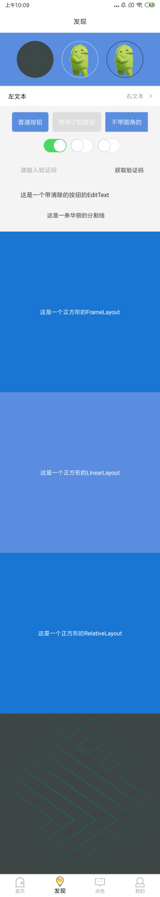
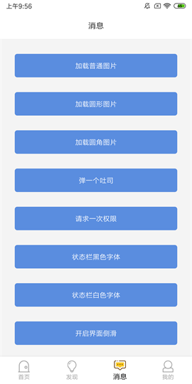
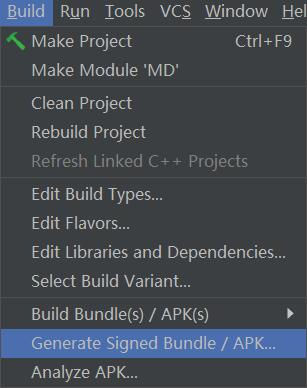
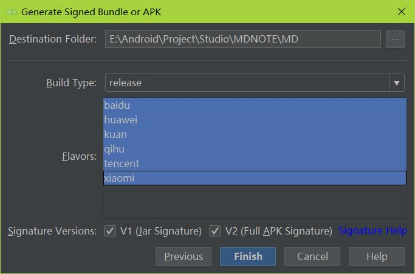
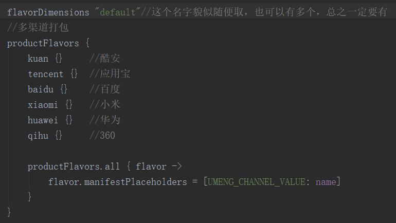

# 项目介绍

## Module 介绍

> 这里的项目 Module 关系十分简单：

* app：关于 APP 功能实现的业务逻辑代码，集成了一些常用的框架

* base：定义一些常用的基类，不集成任何框架

* widget：自定义一些精品的 View，不集成任何框架

> 本项目基于最新的 Android SDK 28 编译，[点击此处查看配置](build.gradle)，最低安装要求为 Android 4.0

> 其中 Android Studio 的版本为3.2，Gradle的版本为 4.4

    targetSdkVersion = 28
    compileSdkVersion = 28
    buildToolsVersion = '28.0.0'

## Activity关系

> 模板项目中的Activity有三层继承关系，Fragment 和 Application 继承关系也是雷同，这里不再赘述

* [BaseActivity](baselibrary/src/main/java/com/hjq/baselibrary/base/BaseActivity.java)：继承至AppCompatActivity，主要做一些简单的代码封装

* [UIActivity](app/src/main/java/com/hjq/demo/common/UIActivity.java)：继承至BaseActivity，主要加入了界面侧滑和状态栏沉浸式

* [CommonActivity](app/src/main/java/com/hjq/demo/common/CommonActivity.java)：继承至UIActivity，主要实现项目中的业务逻辑代码

## 复制模板

> 考虑到 Studio 创建一个 Activity 还是比较费劲的，所以在项目中预留了可供复制的副本

* [CopyActivity.java](app/src/main/java/com/hjq/demo/ui/activity/CopyActivity.java)    对应 [activity_copy.xml](app/src/main/res/layout/activity_copy.xml)

* [CopyFragment.java](app/src/main/java/com/hjq/demo/ui/fragment/CopyFragment.java)    对应 [fragment_copy.xml](app/src/main/res/layout/fragment_copy.xml)

## View 样式

* 普通的圆角 Button 样式：style="@style/ButtonStyle"

* 普通不带圆角 Button 样式：style="@style/RectButtonStyle"

* 普通 EditText 样式：style="@style/EditTextStyle"

* 普通的水平分割线 View 样式：style="@style/HorizontalLineStyle"

* 普通的垂直分割线 View 样式：style="@style/VerticalLineStyle"

## View 使用

> 具体用法可以[点击此处查看示例](app/src/main/res/layout/fragment_test_b.xml)

## 框架使用

> 具体用法可以[点击此处查看示例](app/src/main/java/com/hjq/demo/ui/fragment/TestFragmentC.java)

## 友盟多渠道打包

> 具体配置可以[点击此处查看](app/build.gradle)

> 使用友盟多渠道统计时需要[更换清单文件中的key](app/src/main/AndroidManifest.xml)

    <!-- 友盟统计 -->
    <meta-data
        android:name="UMENG_APPKEY"
        android:value="XXXXXXXXXXXXXXXXXXXXXXXX" /><!-- 要注意更换key -->