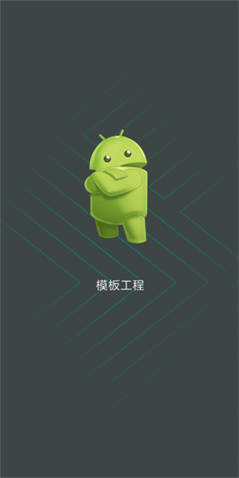
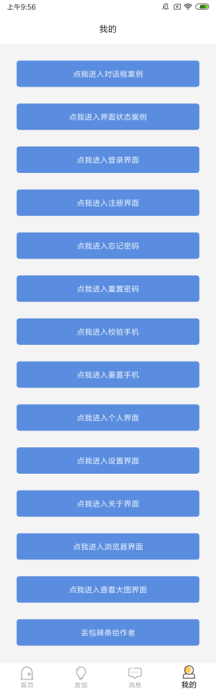
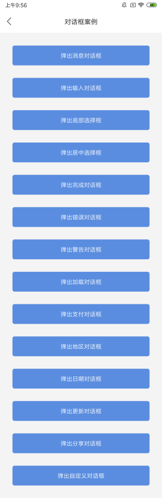
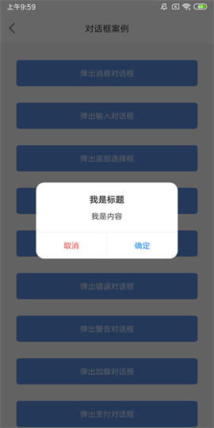
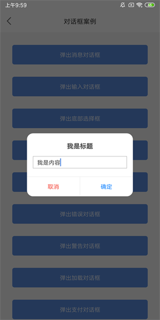
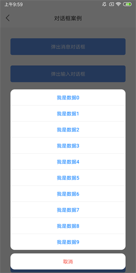

# 模板工程

> 博客地址：[但愿人长久，搬砖不再有](https://www.jianshu.com/p/77dd326f21dc)

> 当我们日复一日年复一年的搬砖的时候，你是否曾想过提升一下开发效率，如果一个模板的项目摆在你的面前，你还会选择自己搭架构么

> 但是做出一个好的模板项目并非易事，有多少人愿意选择去做，还有多少人选择努力去做好，可能寥寥无几，但是你今天看到的，正是你所想要的，一个真正能解决你开发新项目时最大痛点的模板工程，你不需要再麻木 Copy 原有旧项目的代码，只需改动少量代码就能得到想要的效果，你会发现开发新项目其实是一件很快乐的事

> 已经正式投入公司新项目开发多时，暂时没有发现毛病，[点击此处下载Demo](https://raw.githubusercontent.com/getActivity/AndroidProject/master/AndroidProject.apk)，如果有问题随时欢迎你提交 [issues](https://github.com/getActivity/AndroidProject/issues/new) 给我反馈














#### 集成框架

* 权限请求框架：[https://github.com/getActivity/XXPermissions](https://github.com/getActivity/XXPermissions)

* 标题栏：[https://github.com/getActivity/TitleBar](https://github.com/getActivity/TitleBar)

* 吐司工具类：[https://github.com/getActivity/ToastUtils](https://github.com/getActivity/ToastUtils)

* 状态栏沉浸：[https://github.com/gyf-dev/ImmersionBar](https://github.com/gyf-dev/ImmersionBar)

* 界面侧滑功能：[https://github.com/bingoogolapple/BGASwipeBackLayout-Android](https://github.com/bingoogolapple/BGASwipeBackLayout-Android)

* 圆形ImageView：[https://github.com/hdodenhof/CircleImageView](https://github.com/hdodenhof/CircleImageView)

* ButterKnife注解：[https://github.com/JakeWharton/butterknife](https://github.com/JakeWharton/butterknife)

#### 模板项目亮点，[查看详细](ProjectDetails.md)

* APP用户体验：已经集成界面侧滑以及状态栏沉浸框架

* 必备优秀框架：危险权限处理，标题栏控件，吐司工具类，圆形ImageView

* 常用页面模板：启动界面，主页界面，登录界面，注册界面，关于界面，浏览器界面

* 集成友盟统计：集成友盟统计，并且加入了友盟多渠道打包，在发布release包时可选择渠道包

* 界面样式规范：项目的严格按照 Material Design 设计进行配色，统一和规范Button和EditText控件样式

* 常用自定义View：圆形ImageView，验证码点击倒计时View，带清除按钮的EditText，正方形的FrameLayout、LinearLayout、RelativeLayout、ImageView

* 代码注释规范：代码严格按照谷歌级规范来做，如需寻找友盟相关的代码，全局搜索 "友盟" 即可，任何一处不关于原生的 API 都有非常完善的注释

#### 修复Android普遍存在的问题，[查看详细](AndroidBug.md)

* 修复 Button 在Android 5.1 之后英文字符串自动大写的问题

* 修复 Button 在设置状态选择器后仍然残留按压阴影的问题

* 修复某些低配置机型启动页停留在白屏的时间比较长的问题

* 修复某些机型在 WebView 长按时布局被顶下来的问题

* 修复 任务栈中 首页Activity 被重复启动的问题

* 修正 Android 9.0 限制 Http 明文请求的问题

#### Android技术讨论Q群：78797078

## License

```text
Copyright 2018 Huang Jinqun

Licensed under the Apache License, Version 2.0 (the "License");
you may not use this file except in compliance with the License.
You may obtain a copy of the License at

   http://www.apache.org/licenses/LICENSE-2.0

Unless required by applicable law or agreed to in writing, software
distributed under the License is distributed on an "AS IS" BASIS,
WITHOUT WARRANTIES OR CONDITIONS OF ANY KIND, either express or implied.
See the License for the specific language governing permissions and
limitations under the License.
```
