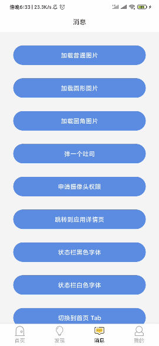
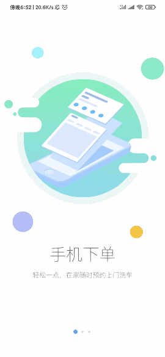
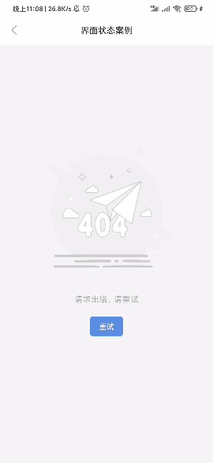
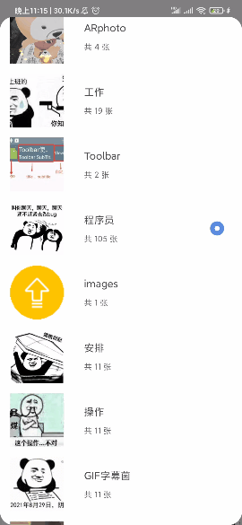
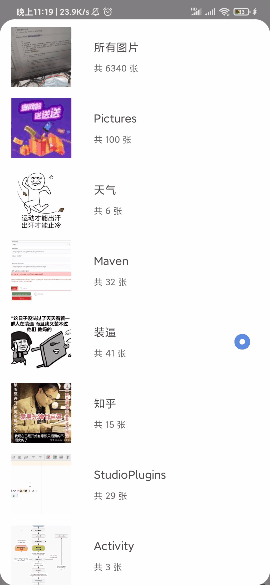
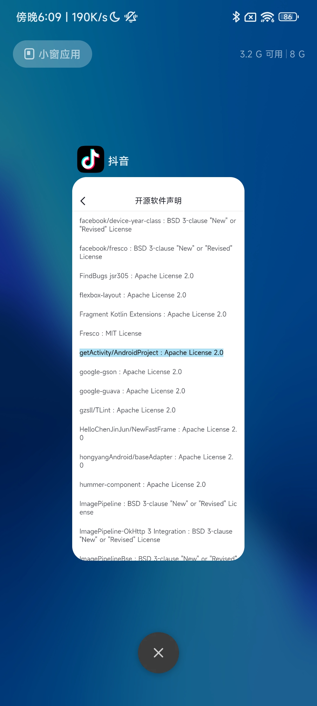

# 安卓技术中台

* 项目地址：[Github](https://github.com/getActivity/AndroidProject)

* Kotlin 版本：[AndroidProject-Kotlin](https://github.com/getActivity/AndroidProject-Kotlin)

* 博客地址：[但愿人长久，搬砖不再有](https://www.jianshu.com/p/77dd326f21dc)

* 当我们日复一日年复一年的搬砖的时候，你是否曾想过提升一下开发效率，如果一个通用的架构摆在你的面前，你还会选择自己搭架构么，但是搭建出一个好的架构并非易事，有多少人愿意选择去做，还有多少人选择努力去做好，可能寥寥无几，但是你今天看到的，正是你所想要的，一个真正能解决你开发新项目时最大痛点的架构工程，你不需要再麻木 Copy 原有旧项目的代码，只需改动少量代码就能得到想要的效果，你会发现开发新项目其实是一件很快乐的事。

* AndroidProject 已维护七年多的时间，几乎耗尽我所有的业余时间，里面的代码改了再改，改了又改，不断 Review、不断创新、不断改进、不断测试、不断优化，每天都在重复这些枯燥的步骤，但是只有这样才能把这件事做好，因为我相信把同样一件事重复做，迟早有一天可以做好。

* 已经正式投入到多个公司项目实践中，暂时没有发现任何问题或者 Bug，[点击下载 Apk 体验](https://github.com/getActivity/AndroidProject/releases/download/13.1/AndroidProject.apk)，又或者扫码下载


#### 常用界面

  

  

  

  

  

  

  

  

  

------


#### 常用对话框

  

  

  

  

  

  

#### 动图欣赏

  

  

  

  

#### 项目亮点

* App 优化：已经进行了全面的内存优化、布局优化、代码优化、瘦身优化，并且对结果进行了严格的长久测试。

* 代码规范：参照 Android SDK 、Support 源码和参考阿里巴巴的代码规范文档对代码进行命名，并对难点代码进行了注释，对重点代码进行了说明。

* 代码统一：对项目中常见的代码进行了封装，或是封装到基类中、或是封装到工具类中、或者封装到框架中，不追求过度封装，根据实际场景和代码维护性考虑，尽量保证同一个功能的代码在项目中不重复。

* 敏捷开发：一个 App 大概率会出现的功能已经写好，对项目的敏捷开发起到了至关重要的作用，可用于新项目开发或者旧项目重构，可将开发周期缩短近一半的时间，并且后续不会因为前期的快速开发而留下成堆的技术遗留问题，万丈高楼平地起，AndroidProject 属于基建工程，而在软件行业我们称之为技术中台。

* 无任何瑕疵：对小屏手机、全面屏手机、带虚拟按键手机进行了适配和优化，确保每一个界面细节都能处理到位、每一个功能细节都能符合大众的需求、乃至每一行代码都能贴合 Android 程序员的审美观。

* 兼容性优良：在此感谢开源道路上给予我支持和帮助的小伙伴，一个人一台机在兼容性面前无能为力，而在几百人几百台机面前却不是问题。如果没有这些的测试，有些问题我一个人可能这辈子都发现不了，纵使代码写得再好，逻辑再严谨，没有经过大众的验证，无异于纸上谈兵。

* 优秀的代码设计：AndroidProject 对 startActivityForResult 的设计进行了改良，使得可以直接在方法上传入监听对象，这样我们就不需要重写 onActivityResult 方法来拿到回调，另外原生的 startActivityForResult 还需要传 requestCode 参数，而 AndroidProject 会自动帮你生成这个 requestCode 码，并在 onActivityResult 进行判断，如果满足条件，那么就会回调外层传入的监听对象。然而这只是冰山一角，更多优秀的代码设计还需要你通过阅读 AndroidProject 源码的形式来发掘，在这里不再细说。

#### [代码规范文档请点击这里查看](https://github.com/getActivity/AndroidCodeStandard)

#### [版本适配文档请点击这里查看](https://github.com/getActivity/AndroidVersionAdapter)

#### [常见问题解答请点击这里查看](HelpDoc.md)

#### 使用案例


[](https://aweme.snssdk.com/draft/douyin_agreement/open_source.html?hide_nav_bar=1&disable_auto_expose=1&font_scale=1.0&is_init_login=1&contact_permission=0&push_permission=1&bounce_disable=1&is_tab=0&launch_method=enter_launch&show_loading=1)

#### 作者的其他开源项目

* 安卓技术中台 Kt 版：[AndroidProject-Kotlin](https://github.com/getActivity/AndroidProject-Kotlin)  

* 权限框架：[XXPermissions](https://github.com/getActivity/XXPermissions)  

* 吐司框架：[Toaster](https://github.com/getActivity/Toaster)  

* 网络框架：[EasyHttp](https://github.com/getActivity/EasyHttp)  

* 标题栏框架：[TitleBar](https://github.com/getActivity/TitleBar)  

* 悬浮窗框架：[EasyWindow](https://github.com/getActivity/EasyWindow)  

* 设备兼容框架：[DeviceCompat](https://github.com/getActivity/DeviceCompat)  

* ShapeView 框架：[ShapeView](https://github.com/getActivity/ShapeView)  

* ShapeDrawable 框架：[ShapeDrawable](https://github.com/getActivity/ShapeDrawable)  

* 语种切换框架：[MultiLanguages](https://github.com/getActivity/MultiLanguages)  

* Gson 解析容错：[GsonFactory](https://github.com/getActivity/GsonFactory)  

* 日志查看框架：[Logcat](https://github.com/getActivity/Logcat)  

* 嵌套滚动布局框架：[NestedScrollLayout](https://github.com/getActivity/NestedScrollLayout)  

* Android 版本适配：[AndroidVersionAdapter](https://github.com/getActivity/AndroidVersionAdapter)  

* Android 代码规范：[AndroidCodeStandard](https://github.com/getActivity/AndroidCodeStandard)  

* Android 资源大汇总：[AndroidIndex](https://github.com/getActivity/AndroidIndex)  

* Android 开源排行榜：[AndroidGithubBoss](https://github.com/getActivity/AndroidGithubBoss)  

* Studio 精品插件：[StudioPlugins](https://github.com/getActivity/StudioPlugins)  

* 表情包大集合：[EmojiPackage](https://github.com/getActivity/EmojiPackage)  

* AI 资源大汇总：[AiIndex](https://github.com/getActivity/AiIndex)  

* 省市区 Json 数据：[ProvinceJson](https://github.com/getActivity/ProvinceJson)  

* Markdown 语法文档：[MarkdownDoc](https://github.com/getActivity/MarkdownDoc)  

#### 微信公众号：Android轮子哥


#### Android 技术 Q 群：10047167

#### 如果您觉得我的开源库帮你节省了大量的开发时间，请扫描下方的二维码随意打赏，要是能打赏个 10.24 :monkey_face:就太:thumbsup:了。您的支持将鼓励我继续创作:octocat:（[点击查看捐赠列表](https://github.com/getActivity/Donate)）

 

## License

```text
Copyright 2018 Huang JinQun

Licensed under the Apache License, Version 2.0 (the "License");
you may not use this file except in compliance with the License.
You may obtain a copy of the License at

   http://www.apache.org/licenses/LICENSE-2.0

Unless required by applicable law or agreed to in writing, software
distributed under the License is distributed on an "AS IS" BASIS,
WITHOUT WARRANTIES OR CONDITIONS OF ANY KIND, either express or implied.
See the License for the specific language governing permissions and
limitations under the License.
```