# 安卓架构

> 博客地址：[但愿人长久，搬砖不再有](https://www.jianshu.com/p/77dd326f21dc)

> 码云地址：[Gitee](https://gitee.com/getActivity/AndroidProject)

> 当我们日复一日年复一年的搬砖的时候，你是否曾想过提升一下开发效率，如果一个通用的基建项目摆在你的面前，你还会选择自己搭架构么

> 但是搭建出一个好的架构并非易事，有多少人愿意选择去做，还有多少人选择努力去做好，可能寥寥无几，但是你今天看到的，正是你所想要的，一个真正能解决你开发新项目时最大痛点的架构工程，你不需要再麻木 Copy 原有旧项目的代码，只需改动少量代码就能得到想要的效果，你会发现开发新项目其实是一件很快乐的事

> 已经正式投入多个公司项目实践，暂时没有发现任何问题，[点击此处下载Demo](AndroidProject.apk)


#### 常用界面

 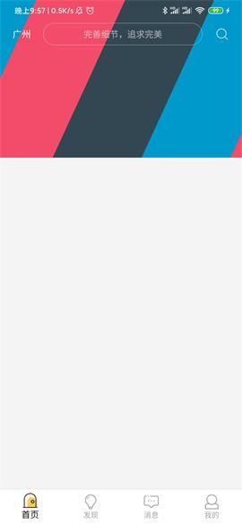 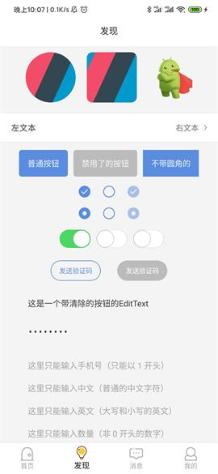

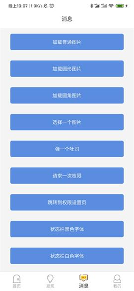  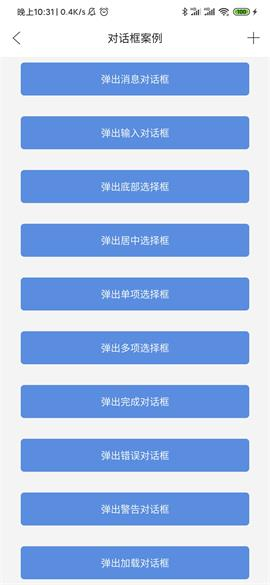

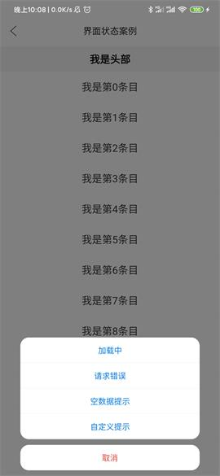  

  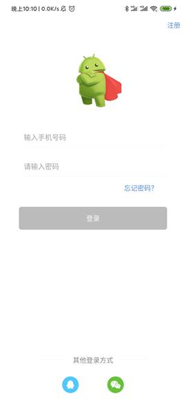

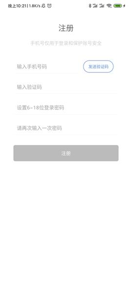  

 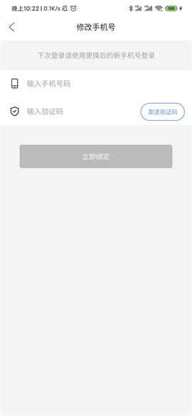 

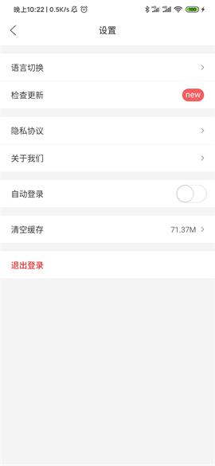 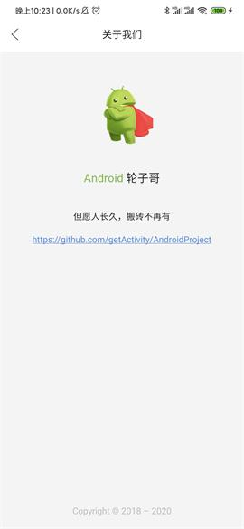 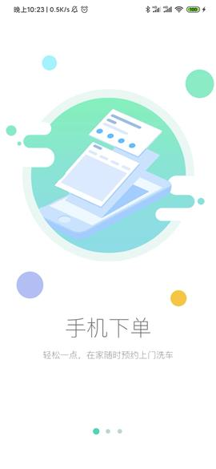

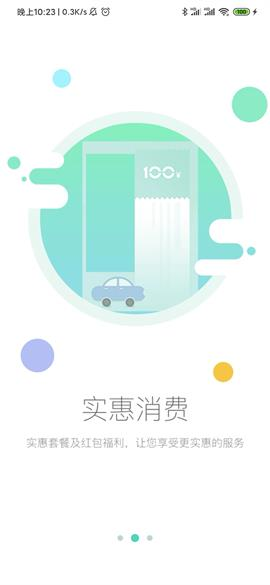 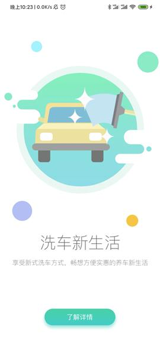 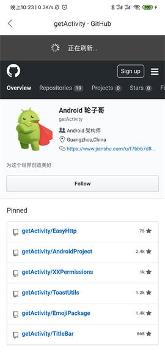

 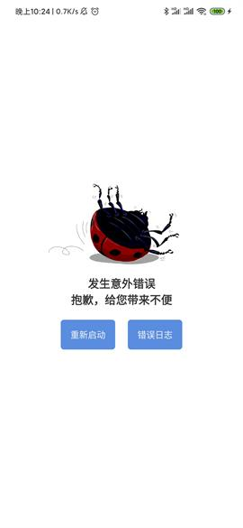 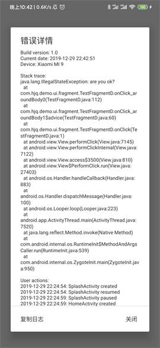

 

------

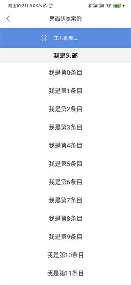

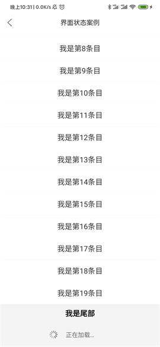


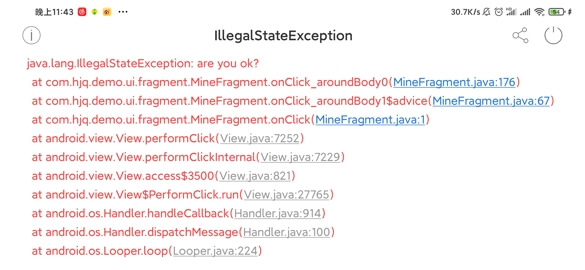

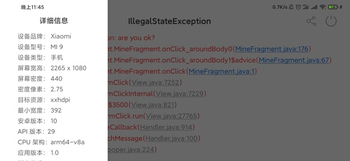

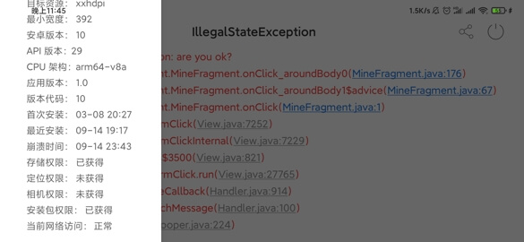


#### 常用对话框

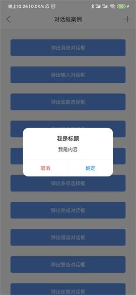 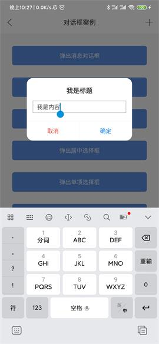 

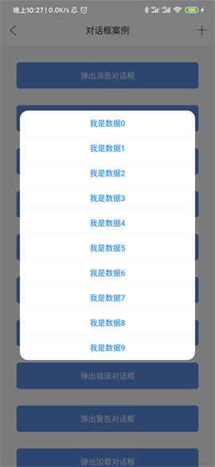 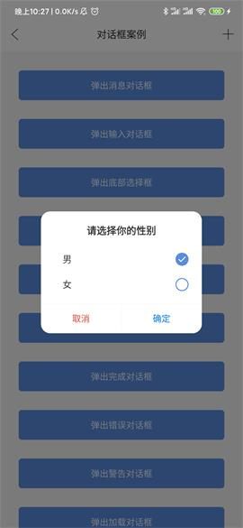 

 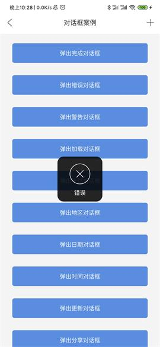 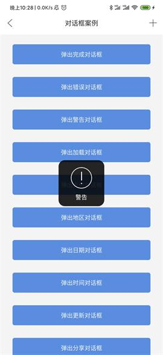

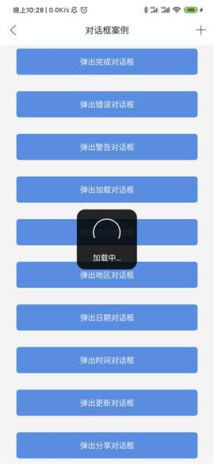 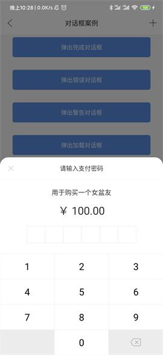 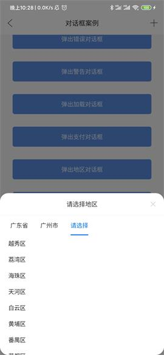

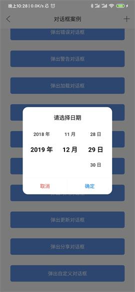 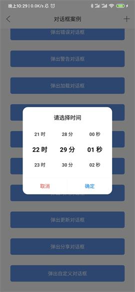 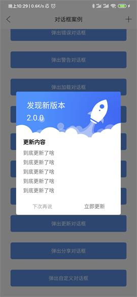

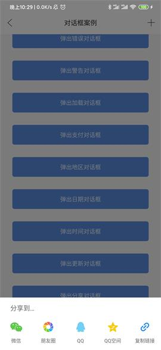 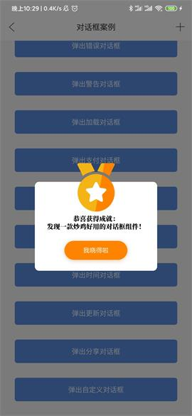 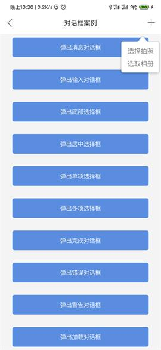

#### 动图欣赏

 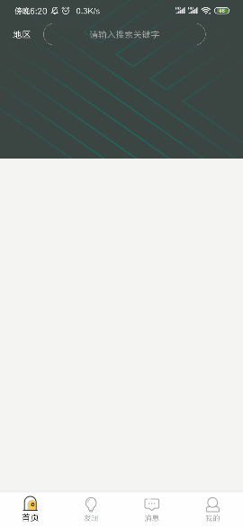 

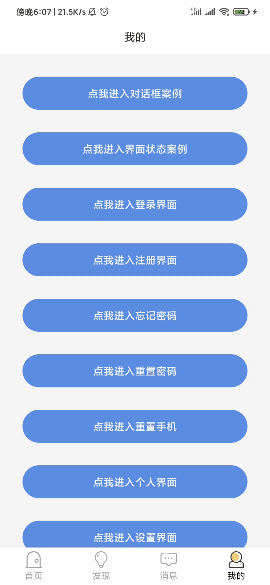 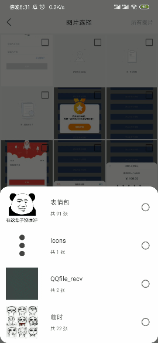 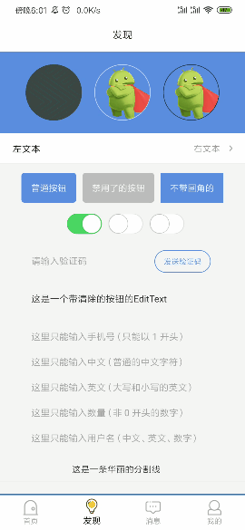

#### 项目亮点

* App 优化：已经进行了全面的内存优化、布局优化、代码优化、瘦身优化，并且对结果进行了严格的长久测试。

* 代码注释：参照 Android SDK 、Support 源码和参考阿里巴巴的代码规范文档对代码进行命名，对难点代码进行了注释，对重点代码进行了说明。

* 代码统一：对项目中常见的代码进行了封装，或是封装到基类中、或是封装到工具类中、或者封装到框架中，不追求过度封装，根据实际场景和代码维护性考虑，尽量保证同一个功能的代码在项目中不重复。

* 敏捷开发：一个 App 大概率会出现的功能已经写好，对项目的敏捷开发起到了至关重要的作用，可用于新项目开发或者旧项目重构，可将开发周期缩短近一半的时间，并且后续不会因为前期的快速开发而留下成堆的技术遗留问题，万丈高楼平地起，AndroidProject 属于基建工程，而在软件行业我们称之为技术中台。

* 无任何瑕疵：对小屏手机、全面屏手机、带虚拟按键手机进行了适配和优化，确保每一个界面细节都能处理到位、每一个功能细节都能符合大众的需求、乃至每一行代码都能贴合 Android 程序员的审美观。

* 兼容性优良：在此感谢开源道路上给予我支持和帮助的小伙伴，一个人一台机在兼容性面前无能为力，而在几百人几百台机面前却不是问题。如果没有这些的测试，有些问题我一个人可能这辈子都发现不了，纵使代码写得再好，逻辑再严谨，没有经过大众的验证，无异于纸上谈兵。

#### 为什么没有用 MVP ？

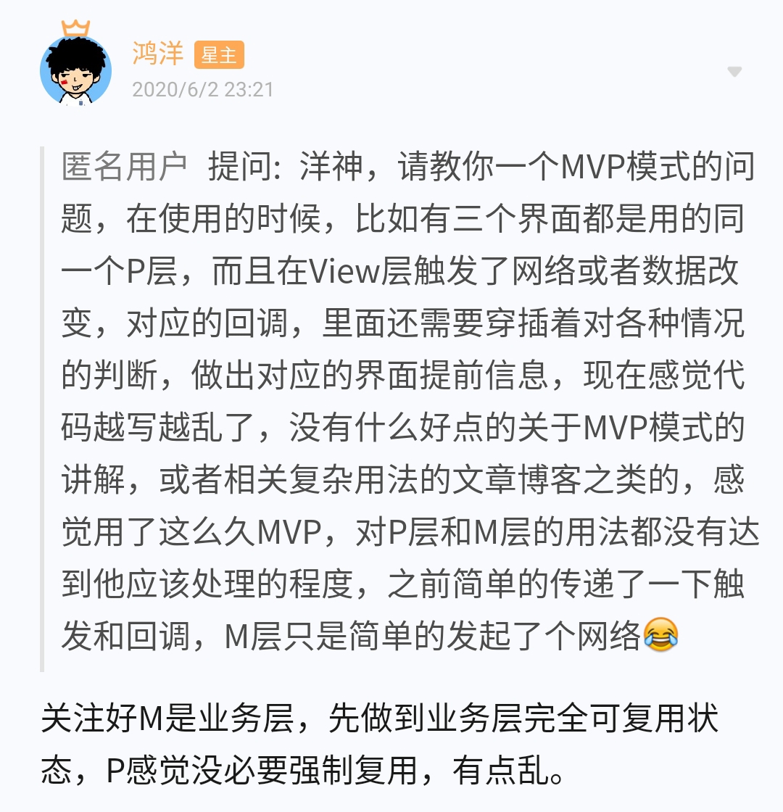

* AndroidProject 舍弃 MVP 的最大一个原因，需要写各种类，各种回调，如果这个页面比较简单的话，使用 MVP 会让原本简单的代码变复杂，导致后续开发和维护成本是非常高，前期付出的代价和后期的维护不成正比关系，当然这种说法只适用于各种中小型项目，大型的项目我还没有经历过，不过我觉得，无论是 MVC、MVP、MVVM，它们出现的目的是为了解决代码多并且乱的问题，作用就是给代码做分类，但是可以跟大家分享我的心得，我并不看好 MVP，因为它让我开发和维护都很痛苦，所以我就直接将它从 AndroidProject 移除，目的也很简单，不推荐大家使用，因为 MVP 不适合大多数项目的开发和维护。我更推荐大家直接将代码写在 Activity，但是有一个前提条件需要大家遵守，大家要做好代码封装和重复代码的抽取，尽量让 Activity 成为只有业务代码的类，这样一个项目里面的大多数 Activity 代码量都能很好控制在 1000 行代码以内。但是这种看似简单的操作，但是实际要做到是一件不容易的事情，这里面不仅要解决代码带来的问题，还要解决带来的各种人性矛盾，困难重重，这种想法经过很长一段时间的思考，虽然写法在开发和维护中效率是非常高的，但是不被大多数人认可，大家更愿意相信 MVC、MVP、MVVM，而很少有人理解这三种模式的本质是什么，就是为了给代码做分类，但这三种模式都不够灵活，很生硬，像是一套套规则，而这样的代码分类，只会让大多数人的开发越来越头疼。

#### 作者的其他开源项目

* 网络框架：[EasyHttp](https://github.com/getActivity/EasyHttp)  （已集成）

* 日志框架：[Logcat](https://github.com/getActivity/Logcat)  （已集成）

* 权限框架：[XXPermissions](https://github.com/getActivity/XXPermissions)  （已集成）

* 吐司框架：[ToastUtils](https://github.com/getActivity/ToastUtils)  （已集成）

* 标题栏框架：[TitleBar](https://github.com/getActivity/TitleBar)  （已集成）

* 悬浮窗框架：[XToast](https://github.com/getActivity/XToast)  （未集成）

* 国际化框架：[MultiLanguages](https://github.com/getActivity/MultiLanguages)  （未集成）

#### Android技术讨论Q群：78797078

#### 如果您觉得我的开源库帮你节省了大量的开发时间，请扫描下方的二维码随意打赏，要是能打赏个 10.24 :monkey_face:就太:thumbsup:了。您的支持将鼓励我继续创作:octocat:

 
 
#### [点击查看捐赠列表](https://github.com/getActivity/Donate)

## License

```text
Copyright 2018 Huang JinQun

Licensed under the Apache License, Version 2.0 (the "License");
you may not use this file except in compliance with the License.
You may obtain a copy of the License at

   http://www.apache.org/licenses/LICENSE-2.0

Unless required by applicable law or agreed to in writing, software
distributed under the License is distributed on an "AS IS" BASIS,
WITHOUT WARRANTIES OR CONDITIONS OF ANY KIND, either express or implied.
See the License for the specific language governing permissions and
limitations under the License.
```