# 安卓架构

> 博客地址：[但愿人长久，搬砖不再有](https://www.jianshu.com/p/77dd326f21dc)

> 当我们日复一日年复一年的搬砖的时候，你是否曾想过提升一下开发效率，如果一个模板的项目摆在你的面前，你还会选择自己搭架构么

> 但是搭建出一个好的架构并非易事，有多少人愿意选择去做，还有多少人选择努力去做好，可能寥寥无几，但是你今天看到的，正是你所想要的，一个真正能解决你开发新项目时最大痛点的架构工程，你不需要再麻木 Copy 原有旧项目的代码，只需改动少量代码就能得到想要的效果，你会发现开发新项目其实是一件很快乐的事

> 已经正式投入多个公司项目实践，暂时没有发现任何问题，[点击此处下载Demo](https://raw.githubusercontent.com/getActivity/AndroidProject/master/AndroidProject.apk)


#### 常用界面

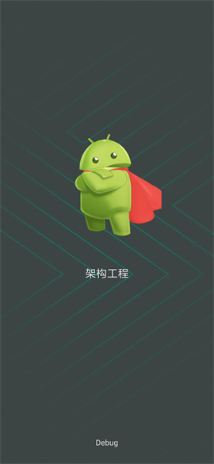 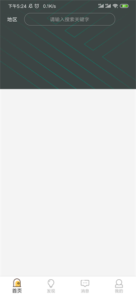 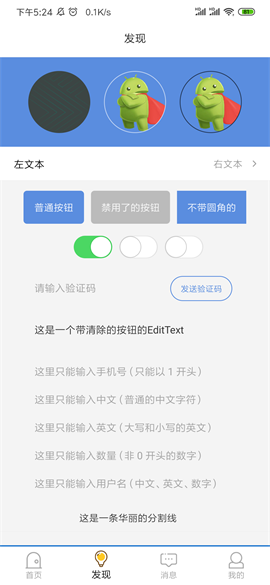

 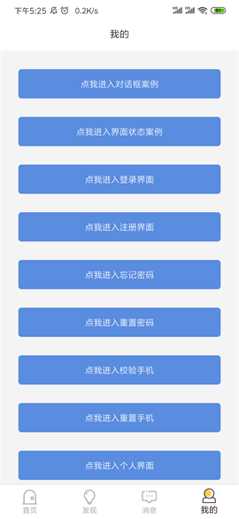 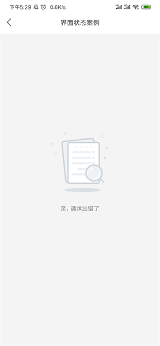

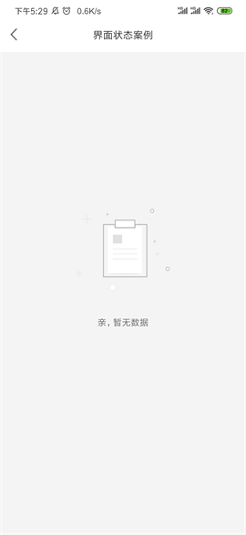 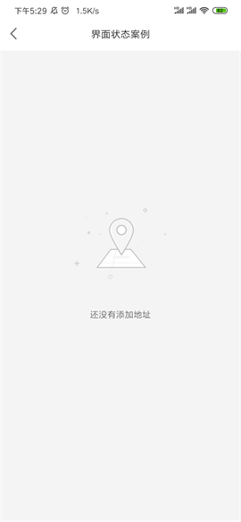 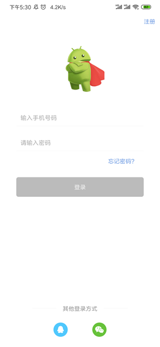

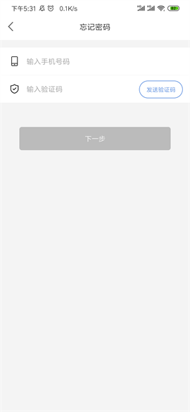  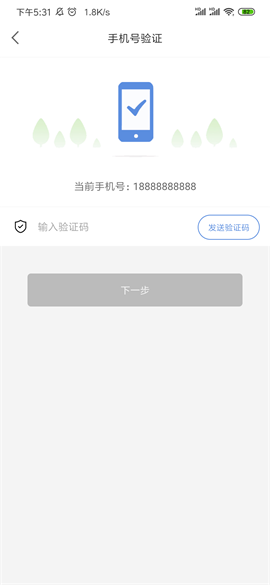

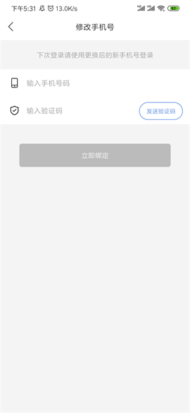  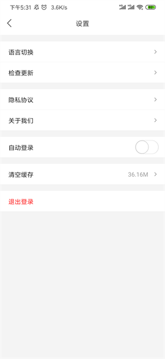

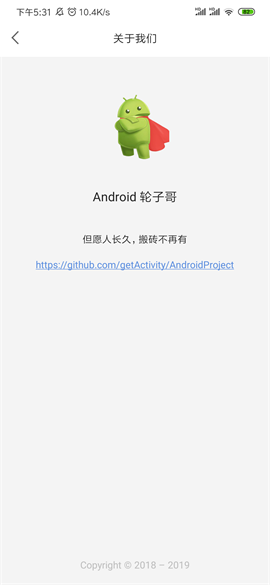 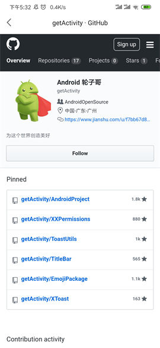 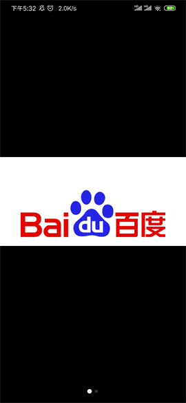

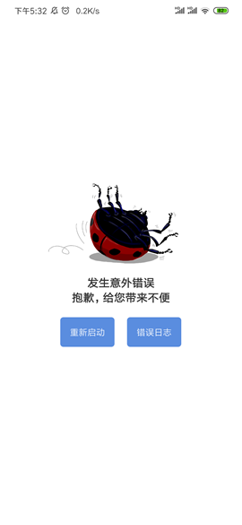 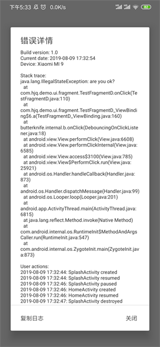 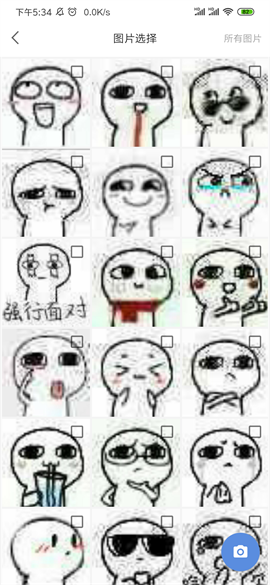

#### 常用对话框

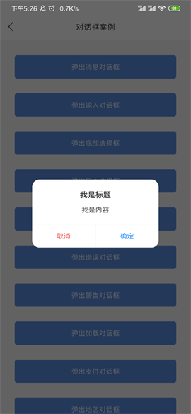 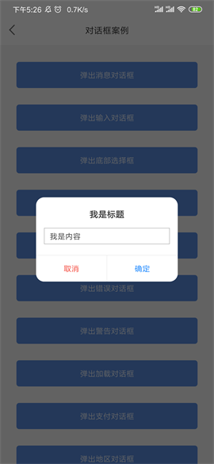 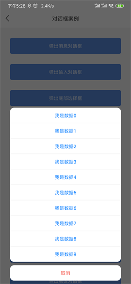

  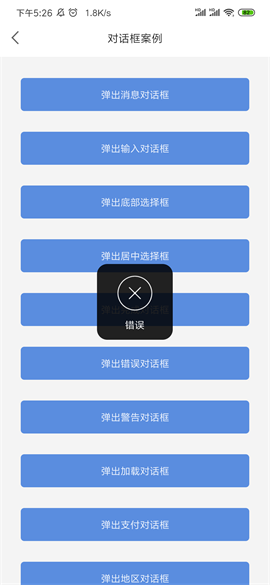

 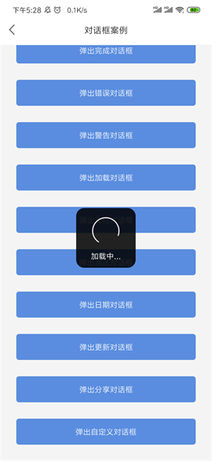 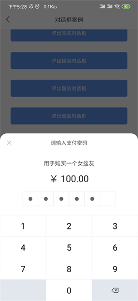

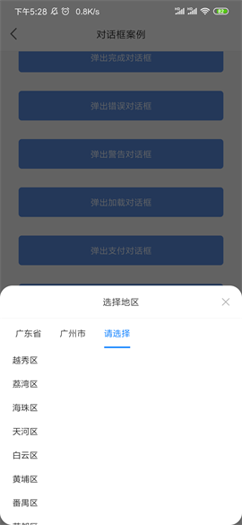 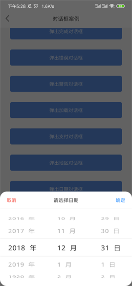 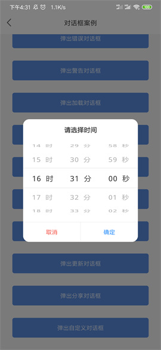

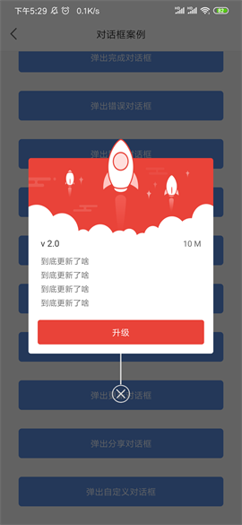 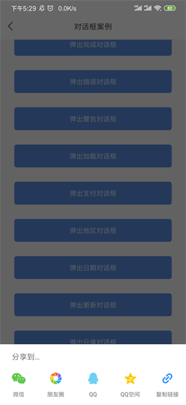 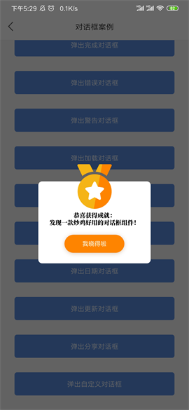

#### 动图欣赏

  

  

#### 集成框架

* 权限请求框架：[https://github.com/getActivity/XXPermissions](https://github.com/getActivity/XXPermissions)

* 标题栏：[https://github.com/getActivity/TitleBar](https://github.com/getActivity/TitleBar)

* 吐司工具类：[https://github.com/getActivity/ToastUtils](https://github.com/getActivity/ToastUtils)

* 状态栏沉浸：[https://github.com/gyf-dev/ImmersionBar](https://github.com/gyf-dev/ImmersionBar)

* 缩放 ImageView：[https://github.com/chrisbanes/PhotoView](https://github.com/chrisbanes/PhotoView)

* ViewPager 指示器：[https://github.com/romandanylyk/PageIndicatorView](https://github.com/romandanylyk/PageIndicatorView)

* ButterKnife 注解：[https://github.com/JakeWharton/butterknife](https://github.com/JakeWharton/butterknife)

* EventBus 事件：[https://github.com/greenrobot/EventBus](https://github.com/greenrobot/EventBus)

* 内存泄漏捕捉：[https://github.com/square/leakcanary](https://github.com/square/leakcanary)

* 本地异常捕捉：[https://github.com/Ereza/CustomActivityOnCrash](https://github.com/Ereza/CustomActivityOnCrash)

#### 模板项目亮点，[查看详细](ProjectDetails.md)

* 必备优秀框架：危险权限处理，标题栏控件，吐司工具类，圆形ImageView

* 常用页面模板：启动界面，主页界面，登录界面，注册界面，关于界面，浏览器界面

* 集成友盟统计：集成友盟统计，并且加入了友盟多渠道打包，在发布release包时可选择渠道包

* 界面样式规范：项目的严格按照 Material Design 设计进行配色，统一和规范Button和EditText控件样式

* 常用自定义View：圆形ImageView，验证码点击倒计时View，带清除按钮的EditText，正方形的FrameLayout、LinearLayout、RelativeLayout、ImageView

* 代码注释规范：代码严格按照谷歌级规范来做，如需寻找友盟相关的代码，全局搜索 "友盟" 即可，任何一处不关于原生的 API 都有非常完善的注释

#### 修复Android普遍存在的问题，[查看详细](AndroidBug.md)

* 修复 Button 在Android 5.1 之后英文字符串自动大写的问题

* 修复 Button 在设置状态选择器后仍然残留按压阴影的问题

* 修复某些低配置机型启动页停留在白屏的时间比较长的问题

* 修复某些机型在 WebView 长按时布局被顶下来的问题

* 修复 任务栈中 首页Activity 被重复启动的问题

* 修正 Android 9.0 限制 Http 明文请求的问题

#### 作者的其他开源项目

* 权限框架：[XXPermissions](https://github.com/getActivity/XXPermissions)

* 吐司框架：[ToastUtils](https://github.com/getActivity/ToastUtils)

* 国际化框架：[MultiLanguages](https://github.com/getActivity/MultiLanguages)

* 标题栏框架：[TitleBar](https://github.com/getActivity/TitleBar)

* 悬浮窗框架：[XToast](https://github.com/getActivity/XToast)

#### Android技术讨论Q群：78797078

#### 如果您觉得我的开源库帮你节省了大量的开发时间，请扫描下方的二维码随意打赏，要是能打赏个 10.24 :monkey_face:就太:thumbsup:了。您的支持将鼓励我继续创作:octocat:

 
 
#### [点击查看捐赠列表](https://github.com/getActivity/Donate)

## License

```text
Copyright 2018 Huang JinQun

Licensed under the Apache License, Version 2.0 (the "License");
you may not use this file except in compliance with the License.
You may obtain a copy of the License at

   http://www.apache.org/licenses/LICENSE-2.0

Unless required by applicable law or agreed to in writing, software
distributed under the License is distributed on an "AS IS" BASIS,
WITHOUT WARRANTIES OR CONDITIONS OF ANY KIND, either express or implied.
See the License for the specific language governing permissions and
limitations under the License.
```
